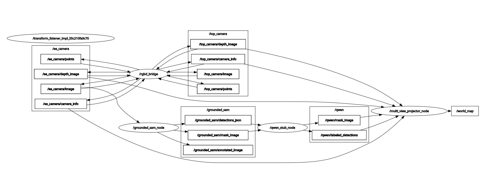

# grounded_sam_ros2_pkg

ROS 2 + Gazebo 환경에서 RGB-D 카메라 이미지를 **Grounded SAM** 으로 세그멘테이션하고,  
결과 마스크를 Depth 이미지와 결합해 **라벨링된 3D PointCloud2** 를 생성하는 파이프라인입니다.

> **목표**: Grounded SAM → Qwen VLM → Mask Projection → MoveIt2  
> **현재 상태**: `qwen_stub_node` 가 label 기반 category 할당 (Qwen/MoveIt2 미연동)

---

## 실행 결과

**GSAM — 마스킹 및 라벨링 결과** (`prompt:="cup, table, object"`)


**RViz2 — Labeled PointCloud2**


**rqt_graph — 노드 연결 구조**



---

## 전체 파이프라인

```
Gazebo (rgbd_projection)
  ee_camera  (front-view)  ← GSAM RGB 입력
  top_camera (overhead)    ← depth only
        │
        ▼
  grounded_sam_node  →  /grounded_sam/mask_image, /grounded_sam/detections_json
        │
        ▼
  qwen_stub_node     →  /qwen/mask_image, /qwen/labeled_detections
        │
        ▼
  multi_view_projector_node
    EE depth + 마스크  →  TARGET(초록) / WORKSPACE(노랑) / OBSTACLE(빨강) / FREE(회색)
    Top depth          →  UNKNOWN(보라), TARGET bbox 내부 제거
    두 뷰 world frame 병합
        ├─▶ /world_map        (PointCloud2, frame_id="world")
        └─▶ /world_map_result (JSON: centroid + bbox_3d_world per category)
```

---

## 패키지 구성

| 패키지 | 역할 | README |
|---|---|---|
| `grounded_sam_pkg` | GSAM 추론 노드, Qwen stub 노드 | [README](src/grounded_sam_pkg/README.md) |
| `mask_projection_pkg` | 2D 마스크 → 3D PointCloud2 | [README](src/mask_projection_pkg/README.md) |
| `rgbd_projection` | Gazebo 시뮬 + bridge + RViz (데모용) | — |

인터페이스 상세: [docs/pipeline_interface.md](docs/pipeline_interface.md)

---

## 시스템 요구사항

- Ubuntu 24.04 / ROS 2 Jazzy / Gazebo Harmonic / Python 3.12

---

## 설치

```bash
git clone --recurse-submodules https://github.com/tydfuyhf/grounded_sam_ros2_pkg.git
cd grounded_sam_ros2_pkg
python3 -m venv gsam_ws_venv && source gsam_ws_venv/bin/activate
pip install torch torchvision
pip install -e external/GroundingDINO -e external/segment-anything
pip install supervision opencv-python-headless pyyaml
mkdir -p models
wget -q https://github.com/IDEA-Research/GroundingDINO/releases/download/v0.1.0-alpha/groundingdino_swint_ogc.pth -O models/groundingdino_swint_ogc.pth
wget -q https://dl.fbaipublicfiles.com/segment_anything/sam_vit_b_01ec64.pth -O models/sam_vit_b_01ec64.pth
source launch_env.bash && colcon build
```

---

## 실행 (Gazebo 데모)

빌드:
```bash
cd ~/gsam_ws && source launch_env.bash
colcon build --packages-select grounded_sam_pkg mask_projection_pkg rgbd_projection
```

터미널 1 — Gazebo + Bridge + RViz:
```bash
cd ~/gsam_ws && source launch_env.bash
ros2 launch rgbd_projection rgbd_sim.launch.py
```

터미널 2 — GSAM:
```bash
cd ~/gsam_ws && source launch_env.bash
ros2 launch grounded_sam_pkg grounded_sam.launch.py \
  prompt:="cup, table, object"
```

터미널 3 — Qwen stub:
```bash
cd ~/gsam_ws && source launch_env.bash
ros2 run grounded_sam_pkg qwen_stub_node
```

터미널 4 — Multi-view projector:
```bash
cd ~/gsam_ws && source launch_env.bash
ros2 launch mask_projection_pkg multi_view_projector.launch.py
```

---

## Isaac Sim 전환

1. `src/mask_projection_pkg/config/camera_extrinsics.yaml` 복사 후 Isaac Sim USD 값으로 수정  
   (상세: [mask_projection_pkg README](src/mask_projection_pkg/README.md#카메라-extrinsics-수정))
2. 토픽 오버라이드하여 실행 (상세: mask_projection_pkg README 참고)

---

## RViz2 설정

Fixed Frame: `world` / Color Transformer: `RGB8` / Topic: `/world_map`

| 색상 | 카테고리 | 의미 |
|---|---|---|
| 회색 | FREE | EE 뷰 배경 |
| 초록 | TARGET | 잡을 물체 |
| 노랑 | WORKSPACE | 작업 테이블 |
| 빨강 | OBSTACLE | 장애물 |
| 보라 | UNKNOWN | Top 뷰 기하 |

---

## 주의사항

- CPU 추론: 프레임당 30~40초 소요
- 매 터미널마다 `source launch_env.bash` 필수
- Gazebo bridge는 VOLATILE QoS — TRANSIENT_LOCAL로 구독하면 이미지 수신 안 됨
- `models/*.pth` 는 gitignore — 직접 다운로드 필요
