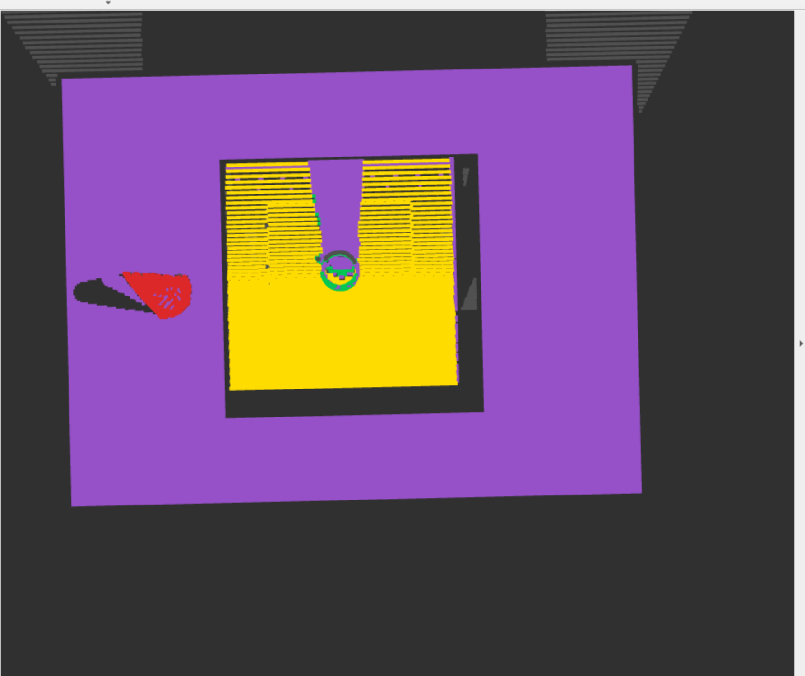
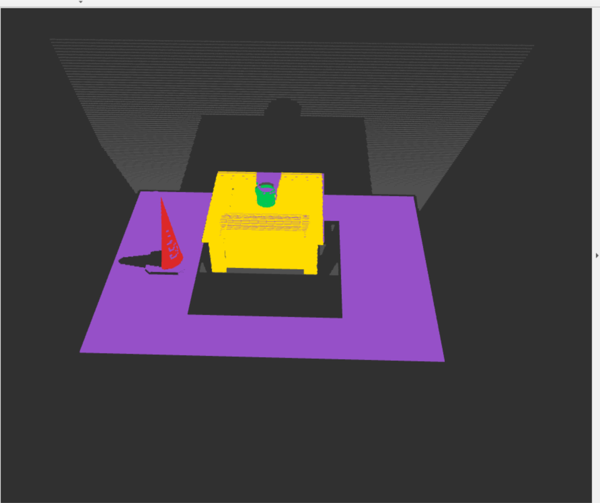
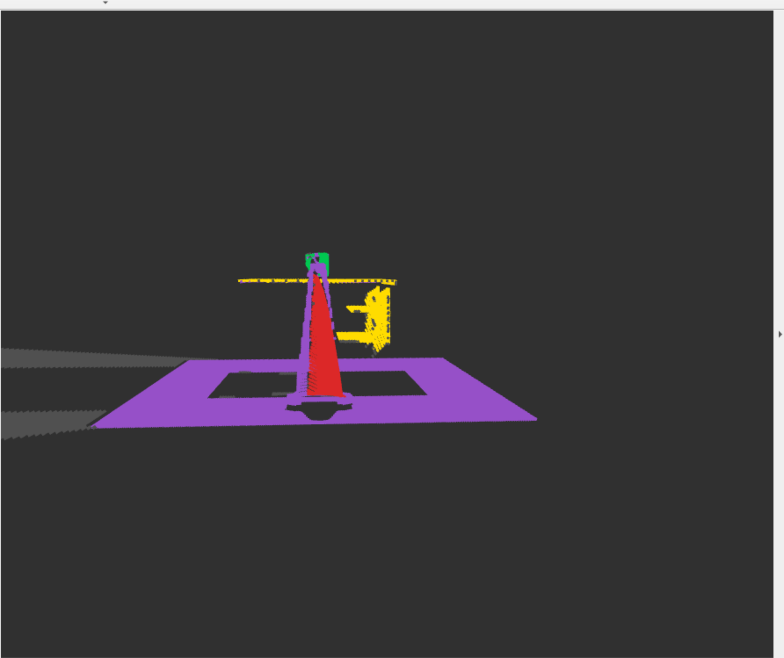
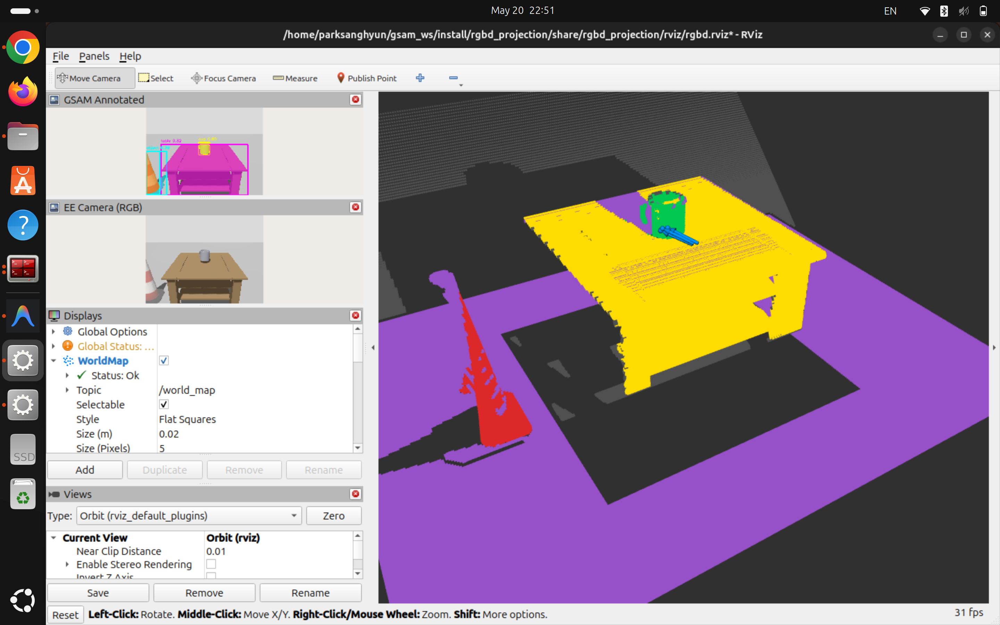
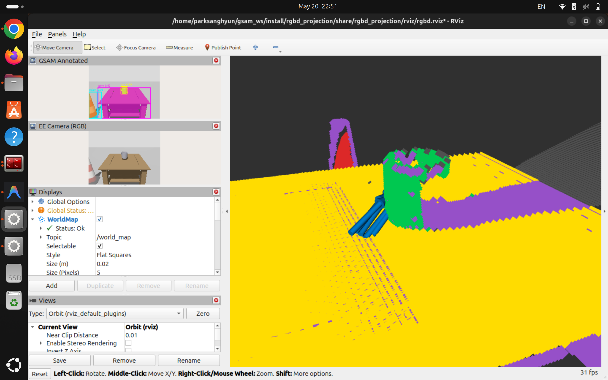

# grounded_sam_ros2_perception

ROS 2 + Gazebo 환경에서 RGB-D 카메라 이미지를 **Grounded SAM** 으로 세그멘테이션하고,  
결과 마스크를 Depth 이미지와 결합해 **라벨링된 3D PointCloud2** 를 생성한 뒤,  
**VGN** 으로 grasp 후보를 검출하는 파이프라인입니다.

> **목표**: Grounded SAM → Qwen VLM → Mask Projection → VGN Grasp → MoveIt2  
> **현재 상태**: `qwen_stub_node`가 label 기반 category 할당 / VGN grasp 검출 구현 완료 / MoveIt2 미연동

---

## 실행 결과

**GSAM — 마스킹 및 라벨링 결과** (`prompt:="cup, table, object"`)


**RViz2 — EE-view Labeled PointCloud2**


Top / Front / Side view에서 확인한 `/world_map` 결과입니다.

| Top view | Front view | Side view |
|---|---|---|
|  |  |  |

**VGN — grasp 후보 출력 (`/grasp_markers`)**

| View 1 | View 2 |
|---|---|
|  |  |

파란 화살표 = grasp approach 방향 (꼬리→화살촉), 밝을수록 quality 높음.

**rqt_graph — 노드 연결 구조**


---

## 전체 파이프라인

```
Gazebo (rgbd_projection)
  ee_camera  (front-view)  ← GSAM RGB 입력
  top_camera (overhead)    ← depth only
        │
        ▼
  grounded_sam_node  →  /grounded_sam/mask_image, /grounded_sam/detections_json
        │
        ▼
  qwen_stub_node     →  /qwen/mask_image, /qwen/labeled_detections
        │
        ▼
  multi_view_projector_node
    EE depth + 마스크  →  TARGET(초록) / WORKSPACE(노랑) / OBSTACLE(빨강) / FREE(회색)
    Top depth          →  UNKNOWN(보라), TARGET bbox 내부 제거
    두 뷰 world frame 병합
        ├─▶ /world_map        (PointCloud2, frame_id="world") — RViz2 시각화
        ├─▶ /world_cloud_raw  (PointCloud2, x/y/z only) — MoveIt2 OctoMap 입력
        └─▶ /world_map_result (JSON: centroid + bbox_3d_world per category)
                │
                ▼
  vgn_grasp_node
    EE depth + Top depth → ray-casting signed TSDF (40×40×40) → VGN inference
    시맨틱 필터: /world_map_result bbox_3d_world 기준
        ├─▶ /grasp_candidates (JSON: Top-K grasp poses)
        └─▶ /grasp_markers    (MarkerArray: RViz2 시각화)
```

---

## 패키지 구성

| 패키지 | 역할 | README |
|---|---|---|
| `grounded_sam_pkg` | GSAM 추론 노드, Qwen stub 노드 | [README](src/grounded_sam_pkg/README.md) |
| `mask_projection_pkg` | 2D 마스크 → 3D PointCloud2 | [README](src/mask_projection_pkg/README.md) |
| `vgn_grasp_pkg` | VGN grasp 검출 노드 | [README](src/vgn_grasp_pkg/README.md) |
| `rgbd_projection` | Gazebo 시뮬 + bridge + RViz (데모용) | — |

인터페이스 상세: [docs/pipeline_interface.md](docs/pipeline_interface.md)

---

## 시스템 요구사항

- Ubuntu 24.04 / ROS 2 Jazzy / Gazebo Harmonic / Python 3.12

---

## 설치

```bash
git clone --recurse-submodules https://github.com/tydfuyhf/grounded_sam_ros2_perception.git
cd grounded_sam_ros2_perception

# VGN 서브모듈 추가 (clone 이후 별도 실행)
git submodule add https://github.com/ethz-asl/vgn external/vgn

# venv 생성 및 의존성 설치
python3 -m venv gsam_ws_venv && source gsam_ws_venv/bin/activate
pip install torch torchvision --index-url https://download.pytorch.org/whl/cu121
pip install -e external/GroundingDINO -e external/segment-anything
pip install supervision opencv-python-headless pyyaml
pip install pytorch-ignite tqdm

# 모델 가중치
mkdir -p models
wget -q https://github.com/IDEA-Research/GroundingDINO/releases/download/v0.1.0-alpha/groundingdino_swint_ogc.pth \
     -O models/groundingdino_swint_ogc.pth
wget -q https://dl.fbaipublicfiles.com/segment_anything/sam_vit_b_01ec64.pth \
     -O models/sam_vit_b_01ec64.pth
# models/vgn_conv.pth  ← ethz-asl/vgn Google Drive data 폴더에서 다운로드
#   data.zip 압축 해제 → data/models/vgn_conv.pth → models/vgn_conv.pth 로 복사
#   파일명 규칙: vgn_<network>.pth  (예: vgn_conv.pth → ConvNet 자동 선택)

# 빌드
source launch_env.bash
colcon build
source install/setup.bash
```

---

## 실행 (Gazebo 데모 — 전체 파이프라인)

**매 터미널마다 먼저 실행:**

```bash
source ~/gsam_ws/launch_env.bash 
```

**터미널 1 — Gazebo + Bridge + RViz:**

```bash
ros2 launch rgbd_projection rgbd_sim.launch.py
```

**터미널 2 — 추론 파이프라인 전체 (GSAM + Qwen stub + Projection + VGN):**

```bash
ros2 launch vgn_grasp_pkg full_pipeline.launch.py
# 옵션: prompt:="cup, table, object" vgn_model_path:=models/vgn_conv.pth
```

GSAM이 첫 탐지 후 자동으로 구독 해제 (`process_once=true` 기본값).  
VGN 추론 완료 후 RViz `/grasp_markers` 에 파란색 화살표로 grasp 후보 표시.

---

### 노드별 개별 실행 (디버깅용)

```bash
ros2 launch grounded_sam_pkg grounded_sam.launch.py prompt:="cup, table, object"
ros2 run grounded_sam_pkg qwen_stub_node
ros2 launch mask_projection_pkg multi_view_projector.launch.py
ros2 launch vgn_grasp_pkg vgn_grasp.launch.py
```

---

## 빌드 (패키지 선택)

```bash
# 전체 빌드
colcon build

# 패키지별 선택 빌드
colcon build --packages-select grounded_sam_pkg mask_projection_pkg rgbd_projection
colcon build --packages-select vgn_grasp_pkg
```

---

## RViz2 설정

| 항목 | 설정값 |
|---|---|
| Fixed Frame | `world` |
| `/world_map` | PointCloud2 / Color Transformer: RGB8 |
| `/grasp_markers` | MarkerArray — 화살표=approach 방향(꼬리→화살촉=접근방향), 파란색(밝을수록 quality 높음) |

**카테고리 색상:**

| 색상 | 카테고리 | 의미 |
|---|---|---|
| 회색 | FREE | EE 뷰 배경 |
| 초록 | TARGET | 잡을 물체 |
| 노랑 | WORKSPACE | 작업 테이블 |
| 빨강 | OBSTACLE | 장애물 |
| 보라 | UNKNOWN | Top 뷰 기하 |

---

## Isaac Sim 전환

1. `src/mask_projection_pkg/config/camera_extrinsics.yaml` 복사 후 Isaac Sim USD 값으로 수정
2. 토픽 오버라이드하여 실행:

```bash
ros2 launch mask_projection_pkg multi_view_projector.launch.py \
  extrinsics_config:=/path/to/camera_extrinsics_isaac.yaml \
  ee_depth_topic:=/isaac/ee/depth_image \
  ee_camera_info_topic:=/isaac/ee/camera_info \
  top_depth_topic:=/isaac/top/depth_image \
  top_camera_info_topic:=/isaac/top/camera_info

ros2 launch vgn_grasp_pkg vgn_grasp.launch.py \
  extrinsics_config:=/path/to/camera_extrinsics_isaac.yaml \
  ee_depth_topic:=/isaac/ee/depth_image \
  ee_camera_info_topic:=/isaac/ee/camera_info \
  top_depth_topic:=/isaac/top/depth_image \
  top_camera_info_topic:=/isaac/top/camera_info \
  robot_frame:=panda_link0
```

상세: [mask_projection_pkg README](src/mask_projection_pkg/README.md)

---

## 주의사항

- CPU 추론: GSAM 프레임당 30~40초, VGN 수 초 소요
- 매 터미널마다 `source launch_env.bash` 필수
- Gazebo bridge는 VOLATILE QoS — TRANSIENT_LOCAL로 구독하면 이미지 수신 안 됨
- `models/*.pth` 는 gitignore — 직접 다운로드 필요
- VGN 모델 파일명 규칙: `vgn_<network>.pth` 형식 필수 (예: `vgn_conv.pth`) — `load_network()`가 파일명에서 네트워크 종류를 파싱함
- `external/vgn`은 ROS 1 기반이지만 추론 함수(`predict`/`process`/`select`)만 사용하므로 ROS 2에서 문제 없음

## 알려진 문제

| 문제 | 원인 | 상태 |
|---|---|---|
| VGN grasp가 물체 내부를 관통 | KDTree unsigned SDF → VGN이 기대하는 signed TSDF와 불일치 | **해결** — depth image ray-casting signed TSDF로 교체 완료 |
| semantic filter 정밀도 저하 가능 | GSAM이 EE 카메라에서만 실행 → TARGET bbox가 컵 앞/옆면만 커버 | 미해결 — 필터가 부정확하면 DBSCAN 클러스터링 적용 예정. `vgn_plan_final.md` 참고 |
| GSAM annotated image가 이상하게 나옴 | EE 카메라 해상도 / Gazebo 씬에 따라 마스크 품질 차이 | 데모 환경에서는 허용 |
