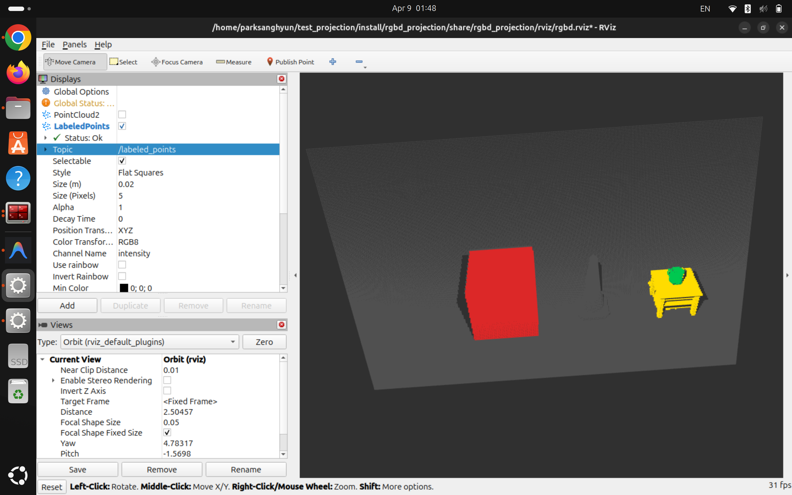
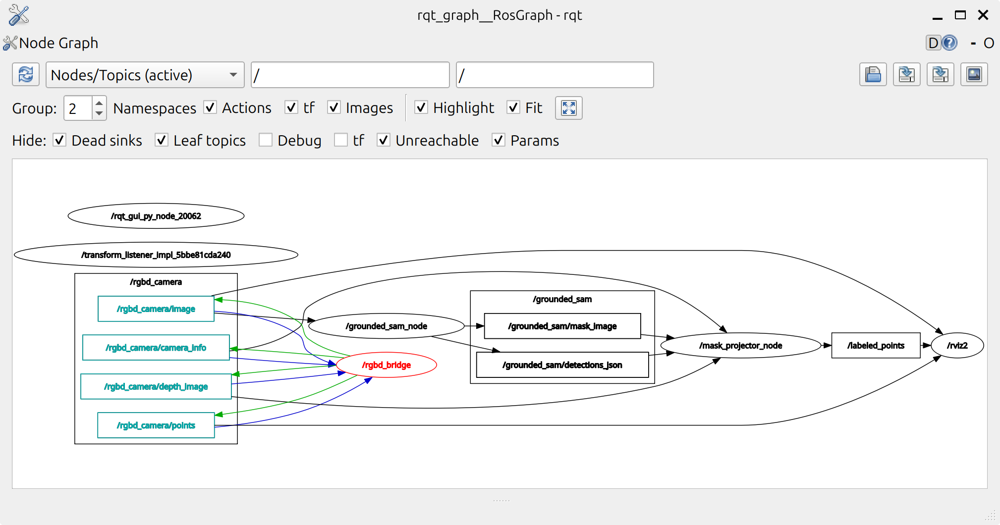

# grounded_sam_ros2_pkg

ROS 2 + Gazebo 환경에서 RGB-D 카메라 이미지를 **Grounded SAM** 으로 세그멘테이션하고,  
결과 마스크를 Depth 이미지와 결합해 **라벨링된 3D PointCloud2** 를 생성하는 파이프라인입니다.

> **최종 목표:** Grounded SAM → Qwen VLM → Mask Projection → MoveIt2  
> **현재 상태 (테스트):** Qwen 미연동. Gazebo 씬에 물체가 각 1개씩이므로 GSAM 출력을 projection 노드가 직접 소비.

---

## 실행 결과

**RViz2 — Labeled PointCloud2**



**rqt_graph — 노드 연결 구조**



---

## 전체 파이프라인

```
Gazebo (rgbd_projection)
  tabletop scene: box + cone + wood_table + teamug
  RGBD 카메라 (위에서 테이블 내려다봄, pitch ~40°)
        │
        │ ros_gz_bridge
        ▼
  /rgbd_camera/image        (RGB)
  /rgbd_camera/depth_image  (float32, meters)
  /rgbd_camera/camera_info  (K matrix)
        │
        ▼
  grounded_sam_pkg
    Grounding DINO → bounding box
    SAM → segmentation mask
        │
        ├─▶ /grounded_sam/mask_image       (mono8, pixel = 1-based object index)
        ├─▶ /grounded_sam/detections_json  (label, confidence, bbox)
        └─▶ /grounded_sam/annotated_image  (시각화용)
        │
        ▼
  mask_projection_pkg
    depth + K → back-projection → 3D points
    mask pixel → semantic category
        │
        ├─▶ /labeled_points      (PointCloud2, XYZRGB + category field)
        └─▶ /projection_result   (JSON: label, centroid, point_count)
        │
        ▼
      RViz2
    색상 기준:
      회색   → FREE      (배경 / 빈 공간)
      노랑   → TARGET    (잡을 물체, mask index 1)
      초록   → WORKSPACE (작업 테이블, mask index 2)
      빨강   → OBSTACLE  (그 외 감지된 물체)
```

---

## 패키지 구성

| 패키지 | 역할 |
|---|---|
| `grounded_sam_pkg` | Grounding DINO + SAM 추론 ROS 2 노드 |
| `rgbd_projection` | Gazebo 시뮬레이션 + bridge + RViz 설정 |
| `mask_projection_pkg` | 2D 마스크 → 3D PointCloud2 변환 노드 |

```
grounded_sam_ros2_pkg/
├── src/
│   ├── grounded_sam_pkg/       # GSAM 추론 노드
│   ├── rgbd_projection/        # Gazebo 시뮬 + RViz
│   └── mask_projection_pkg/    # Projection 노드
│       ├── back_projection.py  # depth → 3D (수학 로직만)
│       ├── label_mapper.py     # mask pixel → 카테고리/색상
│       ├── cloud_builder.py    # PointCloud2 메시지 패킹
│       └── projector_node.py   # ROS 2 노드 (wiring only)
├── external/                   # submodule: GroundingDINO, SAM
├── models/                     # 모델 가중치 (gitignore)
├── config/
│   └── model_paths.yaml
├── launch_env.bash             # venv + ROS + PYTHONPATH 통합 설정
└── README.md
```

---

## 시스템 요구사항

- OS: Ubuntu 24.04
- ROS: ROS 2 Jazzy
- Gazebo: Harmonic (gz-sim 8.x)
- Python: 3.12

---

## 설치

### 1. Clone

```bash
git clone --recurse-submodules https://github.com/tydfuyhf/grounded_sam_ros2_pkg.git
cd grounded_sam_ros2_pkg
```

이미 clone한 경우:

```bash
git submodule update --init --recursive
```

### 2. Python 가상환경 생성

```bash
python3 -m venv gsam_ws_venv
source gsam_ws_venv/bin/activate
pip install torch torchvision
pip install -e external/GroundingDINO
pip install -e external/segment-anything
pip install supervision opencv-python-headless pyyaml
```

### 3. 모델 가중치 다운로드

```bash
mkdir -p models
wget -q https://github.com/IDEA-Research/GroundingDINO/releases/download/v0.1.0-alpha/groundingdino_swint_ogc.pth \
     -O models/groundingdino_swint_ogc.pth
wget -q https://dl.fbaipublicfiles.com/segment_anything/sam_vit_h_4b8939.pth \
     -O models/sam_vit_h_4b8939.pth
```

| 모델 | 파일명 | 크기 |
|---|---|---|
| GroundingDINO SwinT | `groundingdino_swint_ogc.pth` | ~662 MB |
| SAM ViT-H | `sam_vit_h_4b8939.pth` | ~2.4 GB |

### 4. ROS 2 빌드

```bash
source launch_env.bash
colcon build
source install/setup.bash
```

---

## 실행

> 터미널마다 환경 설정이 필요합니다.

**터미널 1 — Gazebo 시뮬레이션 + RViz**

```bash
source /opt/ros/jazzy/setup.bash
source install/setup.bash
ros2 launch rgbd_projection rgbd_sim.launch.py
```

**터미널 2 — Grounded SAM 노드**

```bash
source launch_env.bash
ros2 launch grounded_sam_pkg grounded_sam.launch.py \
  prompt:="cup, table"
```

**터미널 3 — Mask Projection 노드**

```bash
source launch_env.bash
ros2 launch mask_projection_pkg mask_projector.launch.py \
  initials:=tc
```

`initials` 는 출력 파일명에 붙는 접두사입니다 (터미널 2의 `prompt` 첫 글자들과 맞추세요).  
생략하면 `cloud_original_{stamp}.ply` 형식으로 저장됩니다.

Isaac Sim 등 다른 시뮬레이터 토픽으로 오버라이드:

```bash
ros2 launch mask_projection_pkg mask_projector.launch.py \
  initials:=tc \
  depth_topic:=/isaac/depth \
  camera_info_topic:=/isaac/camera_info \
  output_frame_id:=camera_frame
```

---

## 출력 파일

추론 실행 시 `~/gsam_ws/output/` 에 자동 저장됩니다.

| 파일 | 형식 | 설명 |
|---|---|---|
| `result_{initials}.jpg` | JPEG | bbox + mask 오버레이 이미지 (매 프레임 덮어씀) |
| `cloud_original_{initials}_{stamp}.ply` | Binary PLY | 원본 포인트클라우드 (XYZ) |
| `cloud_labeled_{initials}_{stamp}.ply` | Binary PLY | 라벨링된 포인트클라우드 (XYZ + RGB + category) |

- `{initials}` : `prompt` 각 단어의 첫 글자 (예: `"table, cup"` → `tc`)
- `{stamp}` : depth 메시지 타임스탬프 (초 단위)
- PLY 파일은 MeshLab, Open3D, CloudCompare 등으로 열 수 있습니다

---

## RViz 설정

1. `LabeledPoints` 디스플레이 체크박스 켜기
2. `Color Transformer` → `RGB8` 선택
3. 기존 `PointCloud2` (`/rgbd_camera/points`) 체크박스 끄기

포인트 색상:

| 색상 | 카테고리 | 의미 |
|---|---|---|
| 회색 | FREE | 배경 / 빈 공간 |
| 노랑 | TARGET | 잡을 물체 (prompt 첫 번째) |
| 초록 | WORKSPACE | 작업 테이블 (prompt 두 번째) |
| 빨강 | OBSTACLE | 그 외 감지된 물체 |

---

## 발행 토픽 목록

| 토픽 | 타입 | 설명 |
|---|---|---|
| `/rgbd_camera/image` | `sensor_msgs/Image` | RGB 이미지 |
| `/rgbd_camera/depth_image` | `sensor_msgs/Image` | Depth (float32, m) |
| `/rgbd_camera/camera_info` | `sensor_msgs/CameraInfo` | 카메라 내부 파라미터 |
| `/rgbd_camera/points` | `sensor_msgs/PointCloud2` | Gazebo 원본 포인트클라우드 |
| `/grounded_sam/mask_image` | `sensor_msgs/Image` | 세그멘테이션 마스크 (mono8) |
| `/grounded_sam/detections_json` | `std_msgs/String` | 탐지 결과 JSON |
| `/grounded_sam/annotated_image` | `sensor_msgs/Image` | 시각화용 오버레이 이미지 |
| `/labeled_points` | `sensor_msgs/PointCloud2` | 라벨링된 포인트클라우드 |
| `/projection_result` | `std_msgs/String` | 카테고리별 centroid JSON |

---

## 모델 설정 변경 (`config/model_paths.yaml`)

```yaml
grounding_dino:
  device: "cpu"   # GPU 있으면 "cuda" 로 변경

sam:
  model_type: "vit_h"   # vit_h | vit_l | vit_b
  device: "cpu"         # GPU 있으면 "cuda" 로 변경
```

SAM 모델 크기 비교:

| `model_type` | 파일 | 크기 | 속도 |
|---|---|---|---|
| `vit_h` | `sam_vit_h_4b8939.pth` | 2.4 GB | 느림 / 정확 |
| `vit_l` | `sam_vit_l_0b3195.pth` | 1.2 GB | 중간 |
| `vit_b` | `sam_vit_b_01ec64.pth` | 375 MB | 빠름 / 덜 정확 |

---

## 주의사항

**CPU 환경 (노트북 등)**
- `config/model_paths.yaml` 의 `device: "cpu"` 설정으로 GPU 없이 동작합니다.
- SAM ViT-H + Grounding DINO SwinT 를 CPU 추론 시 **프레임당 30~40초** 소요됩니다.
- 추론 속도가 중요하면 `vit_b` 모델로 변경하거나 GPU 환경에서 실행하세요.

**타임스탬프 동기화**
- `mask_projector_node` 는 `ApproximateTimeSynchronizer` 를 사용하지 않습니다.
- CPU 추론 지연(30~40초) 때문에 depth 큐와 timestamp 매칭이 불가능하기 때문입니다.
- 대신 depth/camera_info 최신값을 캐시하고, **mask_image 수신 시 즉시 projection** 을 트리거합니다.

**QoS 설정**
- Gazebo bridge 는 VOLATILE QoS 로 발행합니다.
- `grounded_sam_node` 의 image subscription 도 VOLATILE(depth=10) 로 설정되어 있습니다.
- TRANSIENT_LOCAL 로 구독하면 `incompatible QoS` 경고와 함께 이미지를 수신하지 못합니다.

**`launch_env.bash` 필수**
- venv site-packages, GroundingDINO, SAM 소스 경로를 `PYTHONPATH` 에 추가합니다.
- Grounded SAM 노드 실행 전 반드시 `source launch_env.bash` 를 먼저 실행하세요.
- 이 없이 실행하면 `ModuleNotFoundError: No module named 'torch'` 또는 `groundingdino` 에러가 발생합니다.

**모델 가중치**
- `models/*.pth` 는 `.gitignore` 로 추적되지 않습니다. 직접 다운로드하세요.
- `gsam_ws_venv/` 도 추적되지 않습니다. 가상환경은 직접 생성하세요.

---

## 향후 계획

- Qwen VLM 연동: GSAM 감지 결과 → Qwen 추론 (어떤 물체가 target/workspace인지 결정) → projection 노드로 전달
- MoveIt2 연동: `/labeled_points` 의 TARGET centroid 좌표를 goal pose 로 활용
- Isaac Sim 어댑터: `mask_projector.launch.py` 의 토픽 파라미터만 변경하면 전환 가능
- `/projection_result` 포맷을 `target_coordinate` 필드 기반 JSON 으로 확장
