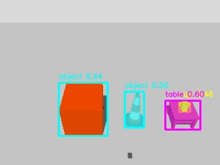
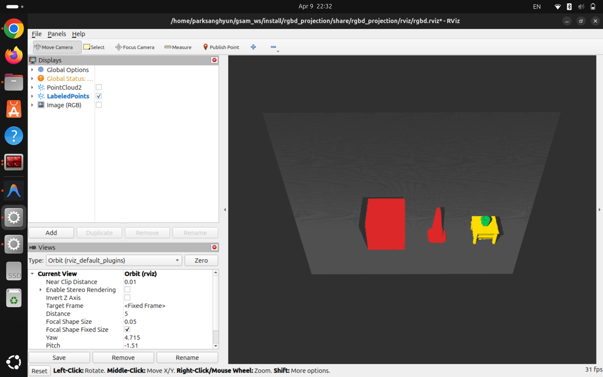
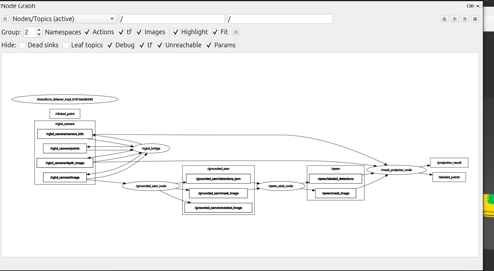

# grounded_sam_ros2_pkg

ROS 2 + Gazebo 환경에서 RGB-D 카메라 이미지를 **Grounded SAM** 으로 세그멘테이션하고,  
결과 마스크를 Depth 이미지와 결합해 **라벨링된 3D PointCloud2** 를 생성하는 파이프라인입니다.

> **최종 목표:** Grounded SAM → Qwen VLM → Mask Projection → MoveIt2  
> **현재 상태:** `qwen_stub_node` 가 label 기반으로 category를 할당하는 중간 노드 역할.  
> Qwen 실제 연동 및 MoveIt2 연동은 팀원 담당.

---

## 실행 결과

**GSAM — 마스킹 및 라벨링 결과** (`prompt:="cup, table, object"`)



**RViz2 — Labeled PointCloud2**



**rqt_graph — 노드 연결 구조**



---

## 전체 파이프라인

```
Gazebo (rgbd_projection)
  tabletop scene: box + cone + wood_table + teamug
  ┌─ ee_camera  (front-view, z=2.5m, pitch=26°)  ← GSAM 입력
  └─ top_camera (overhead,   z=2.5m, pitch=90°)  ← depth-only
        │ ros_gz_bridge
        ▼
  /ee_camera/image        /ee_camera/depth_image  /ee_camera/camera_info
  /top_camera/depth_image /top_camera/camera_info
        │
        ▼
  grounded_sam_node  ← /ee_camera/image 만 입력
    GroundingDINO → bounding box
    SAM (ViT-B)   → segmentation mask
        ├─▶ /grounded_sam/mask_image       (mono8, pixel = 1-based idx)
        ├─▶ /grounded_sam/detections_json  (idx, label, confidence, bbox_xyxy)
        └─▶ /grounded_sam/annotated_image
        │
        ▼
  qwen_stub_node  (실제 Qwen VLM 대체 임시 노드)
    cup → TARGET / table → WORKSPACE / 나머지 → OBSTACLE
        ├─▶ /qwen/mask_image
        └─▶ /qwen/labeled_detections
        │
        ▼
  multi_view_projector_node
    EE depth  + GSAM 마스크  →  TARGET / WORKSPACE / OBSTACLE / FREE
      └─ TARGET 3D bbox 계산 → Top 뷰에서 TARGET 영역 제거
    Top depth               →  UNKNOWN (씬 기하, 보라)
    두 뷰 world frame 변환 후 병합
    extrinsics: src/mask_projection_pkg/config/camera_extrinsics.yaml
        ├─▶ /world_map        (PointCloud2, frame_id="world")
        └─▶ /world_map_result (JSON: centroid + bbox_3d_world per category)
        │
        ▼
      RViz2
    회색→FREE  초록→TARGET  노랑→WORKSPACE  빨강→OBSTACLE  보라→UNKNOWN
```

---

## 패키지 구성

| 패키지 | 역할 |
|---|---|
| `grounded_sam_pkg` | Grounding DINO + SAM 추론 노드, Qwen stub 노드 |
| `rgbd_projection` | Gazebo 시뮬레이션 + bridge + RViz 설정 (데모용) |
| `mask_projection_pkg` | 2D 마스크 → 3D PointCloud2 변환 노드 |

```
grounded_sam_ros2_pkg/
├── src/
│   ├── grounded_sam_pkg/
│   │   ├── ros_node.py          # GSAM 추론 노드
│   │   ├── qwen_stub_node.py    # Qwen 임시 stub 노드
│   │   ├── postprocess.py       # 탐지 결과 포맷 변환
│   │   └── pipeline.py          # GroundingDINO + SAM 추론
│   ├── rgbd_projection/         # Gazebo 시뮬 + RViz
│   └── mask_projection_pkg/
│       ├── back_projection.py   # depth → 3D (수학 로직)
│       ├── label_mapper.py      # mask pixel + category → 색상
│       ├── cloud_builder.py     # PointCloud2 메시지 패킹
│       └── multi_view_projector_node.py  # ROS 2 노드
├── external/                    # submodule: GroundingDINO, SAM
├── models/                      # 모델 가중치 (gitignore)
├── docs/
│   └── pipeline_interface.md    # 파이프라인 인터페이스 설계 문서
├── launch_env.bash              # venv + ROS + PYTHONPATH 통합 설정
└── README.md
```

---

## 시스템 요구사항

- OS: Ubuntu 24.04
- ROS: ROS 2 Jazzy
- Gazebo: Harmonic (gz-sim 8.x)
- Python: 3.12

---

## 설치

### 1. Clone

```bash
git clone --recurse-submodules https://github.com/tydfuyhf/grounded_sam_ros2_pkg.git
cd grounded_sam_ros2_pkg
```

이미 clone한 경우:

```bash
git submodule update --init --recursive
```

### 2. Python 가상환경 생성

```bash
python3 -m venv gsam_ws_venv
source gsam_ws_venv/bin/activate
pip install torch torchvision
pip install -e external/GroundingDINO
pip install -e external/segment-anything
pip install supervision opencv-python-headless pyyaml
```

### 3. 모델 가중치 다운로드

```bash
mkdir -p models
wget -q https://github.com/IDEA-Research/GroundingDINO/releases/download/v0.1.0-alpha/groundingdino_swint_ogc.pth \
     -O models/groundingdino_swint_ogc.pth
wget -q https://dl.fbaipublicfiles.com/segment_anything/sam_vit_b_01ec64.pth \
     -O models/sam_vit_b_01ec64.pth
```

| 모델 | 파일명 | 크기 |
|---|---|---|
| GroundingDINO SwinT | `groundingdino_swint_ogc.pth` | ~662 MB |
| SAM ViT-B | `sam_vit_b_01ec64.pth` | ~375 MB |

### 4. ROS 2 빌드

```bash
source launch_env.bash
colcon build
```

---

## 실행 (Gazebo 데모, prompt="cup, table, object")

**빌드**
```bash
cd ~/gsam_ws && source launch_env.bash
colcon build --packages-select grounded_sam_pkg mask_projection_pkg rgbd_projection
```

**터미널 1 — Gazebo + Bridge + RViz**
```bash
cd ~/gsam_ws && source launch_env.bash
ros2 launch rgbd_projection rgbd_sim.launch.py
```

**터미널 2 — GSAM** (EE 카메라 RGB 입력, CPU ~30–40초/프레임)
```bash
cd ~/gsam_ws && source launch_env.bash
ros2 launch grounded_sam_pkg grounded_sam.launch.py \
  image_topic:=/ee_camera/image \
  prompt:="cup, table, object"
```

**터미널 3 — Qwen stub** (cup→TARGET, table→WORKSPACE, 나머지→OBSTACLE)
```bash
cd ~/gsam_ws && source launch_env.bash
ros2 run grounded_sam_pkg qwen_stub_node
```

**터미널 4 — Multi-view projector** (EE + Top depth 융합 → /world_map)
```bash
cd ~/gsam_ws && source launch_env.bash
ros2 launch mask_projection_pkg multi_view_projector.launch.py
```

**Isaac Sim 전환 시 (팀원)**
```bash
# 1. camera_extrinsics.yaml 복사 후 USD stage 값으로 수정
cp src/mask_projection_pkg/config/camera_extrinsics.yaml \
   src/mask_projection_pkg/config/camera_extrinsics_isaac.yaml

# 2. multi_view_projector 재기동 (YAML + 토픽 오버라이드)
cd ~/gsam_ws && source launch_env.bash
ros2 launch mask_projection_pkg multi_view_projector.launch.py \
  extrinsics_config:=$(pwd)/src/mask_projection_pkg/config/camera_extrinsics_isaac.yaml \
  ee_depth_topic:=/isaac/ee/depth_image \
  ee_camera_info_topic:=/isaac/ee/camera_info \
  top_depth_topic:=/isaac/top/depth_image \
  top_camera_info_topic:=/isaac/top/camera_info \
  mask_topic:=/qwen/mask_image \
  detections_topic:=/qwen/labeled_detections
```

---

## 출력 파일

추론 실행 시 `~/gsam_ws/output/` 에 자동 저장됩니다.

| 파일 | 설명 |
|---|---|
| `result_{initials}.jpg` | bbox + mask 오버레이 이미지 |
| `world_map_{initials}_{stamp}.ply` | 월드 좌표계 라벨링 포인트클라우드 (XYZ + RGB + category) |

- `{initials}` : `prompt` 각 단어의 첫 글자 (예: `"cup, table, object"` → `cto`)
- PLY 파일은 MeshLab, Open3D, CloudCompare 등으로 열 수 있습니다

---

## RViz 설정

1. `PointCloud2` 디스플레이 추가 → Topic: `/world_map`
2. `Color Transformer` → `RGB8` 선택
3. Fixed Frame → `world`

포인트 색상:

| 색상 | 카테고리 | 의미 |
|---|---|---|
| 회색 | FREE | EE 뷰 배경 (비탐지 픽셀) |
| 초록 | TARGET | 잡을 물체 |
| 노랑 | WORKSPACE | 작업 테이블 |
| 빨강 | OBSTACLE | 그 외 감지된 물체 |
| 보라 | UNKNOWN | Top 뷰 기하 (분류 미적용) |

---

## 발행 토픽 목록

| 토픽 | 타입 | 발행 노드 | 설명 |
|---|---|---|---|
| `/ee_camera/image` | `sensor_msgs/Image` | Gazebo | EE 카메라 RGB |
| `/ee_camera/depth_image` | `sensor_msgs/Image` | Gazebo | EE Depth (float32, m) |
| `/ee_camera/camera_info` | `sensor_msgs/CameraInfo` | Gazebo | EE 카메라 내부 파라미터 |
| `/top_camera/depth_image` | `sensor_msgs/Image` | Gazebo | Top Depth (float32, m) |
| `/top_camera/camera_info` | `sensor_msgs/CameraInfo` | Gazebo | Top 카메라 내부 파라미터 |
| `/grounded_sam/mask_image` | `sensor_msgs/Image` | grounded_sam_node | 세그멘테이션 마스크 (mono8) |
| `/grounded_sam/detections_json` | `std_msgs/String` | grounded_sam_node | 탐지 결과 JSON |
| `/grounded_sam/annotated_image` | `sensor_msgs/Image` | grounded_sam_node | 시각화용 오버레이 이미지 |
| `/qwen/mask_image` | `sensor_msgs/Image` | qwen_stub_node | 마스크 pass-through |
| `/qwen/labeled_detections` | `std_msgs/String` | qwen_stub_node | category 필드 추가된 JSON |
| `/world_map` | `sensor_msgs/PointCloud2` | multi_view_projector_node | EE+Top 융합 포인트클라우드 (world frame) |
| `/world_map_result` | `std_msgs/String` | multi_view_projector_node | 카테고리별 centroid + bbox_3d JSON |

---

## 모델 경로 및 설정 (`src/grounded_sam_pkg/config/model_paths.yaml`)

`launch_env.bash` 가 `$GSAM_WS` 환경변수를 자동으로 설정하므로 경로 수정 없이 사용할 수 있습니다.

```yaml
grounding_dino:
  config_file: "${GSAM_WS}/external/GroundingDINO/groundingdino/config/GroundingDINO_SwinT_OGC.py"
  checkpoint:  "${GSAM_WS}/models/groundingdino_swint_ogc.pth"
  box_threshold: 0.35
  text_threshold: 0.25
  device: "cpu"   # GPU 있으면 "cuda"

sam:
  model_type: "vit_b"
  checkpoint: "${GSAM_WS}/models/sam_vit_b_01ec64.pth"
  device: "cpu"   # GPU 있으면 "cuda"
```

---

## 주의사항

**CPU 환경 (노트북 등)**
- SAM ViT-B + Grounding DINO SwinT CPU 추론 시 **프레임당 30~40초** 소요됩니다.

**타임스탬프 동기화**
- `multi_view_projector_node` 는 `ApproximateTimeSynchronizer` 를 사용하지 않습니다.
- CPU 추론 지연(30~40초) 때문에 depth 큐와 timestamp 매칭이 불가능합니다.
- depth/camera_info/detections 최신값을 캐시하고 **mask_image 수신 시 즉시 projection** 을 트리거합니다.

**QoS 설정**
- Gazebo bridge 는 VOLATILE QoS 로 발행합니다.
- TRANSIENT_LOCAL 로 구독하면 `incompatible QoS` 경고와 함께 이미지를 수신하지 못합니다.

**`launch_env.bash` 필수**
- venv site-packages, GroundingDINO, SAM 소스 경로를 `PYTHONPATH` 에 추가합니다.
- Grounded SAM 노드 실행 전 반드시 `source launch_env.bash` 를 먼저 실행하세요.

**모델 가중치**
- `models/*.pth` 는 `.gitignore` 로 추적되지 않습니다. 직접 다운로드하세요.

---

## 향후 계획

- **Qwen VLM 연동**: `qwen_stub_node` 를 실제 Qwen API 호출로 교체. instruction 의미 해석으로 TARGET/WORKSPACE 결정
- **MoveIt2 연동**: `/world_map_result` 의 TARGET `centroid` + `bbox_3d_world` → goal pose, OBSTACLE + UNKNOWN → octomap 충돌 맵
- **Isaac Sim 어댑터**: launch 토픽 파라미터 오버라이드 + `camera_extrinsics.yaml` 교체만으로 전환 가능
